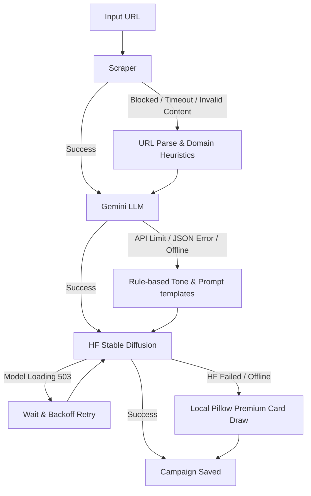

# Auto-Marketer AI Orchestration Pipeline

Developed by: **Navneet Yadav**

Welcome to the **Auto-Marketer AI Orchestration Pipeline**, a premium, robust AI-powered tool designed to automatically generate high-quality marketing campaigns (brand tone analysis, punchy social media captions, and visual assets) from a single website landing page. 

This pipeline is engineered with end-to-end resilience at its core. Every network API call and file access is wrapped in error handling, retries, and local fail-safe procedures to ensure that the application never crashes, even when offline or facing API quota blocks.

---

## Project Structure

```text
├── app.py                  # Flask web backend, API endpoints & central logging
├── scraper.py              # Website scraper with rotating User-Agents & Content-Type validation
├── llm.py                  # Gemini Campaign client & JSON synthesis/regex recovery engine
├── image_generator.py      # HuggingFace Stable Diffusion client & Pillow graphic rendering engine
├── main.py                 # CLI orchestrator & unicode-friendly slug generator
├── templates/
│   └── index.html          # Glassmorphic responsive frontend dashboard (AJAX driven)
├── output/                 # Folder where generated campaigns are stored
├── fonts/                  # Local Google Fonts cache (downloaded on demand for PIL fallback)
├── .env                    # Configuration file for private API keys
└── README.md               # User guide & system documentation (This file)
```

---

## Setup & Installation

### 1. Prerequisites
Ensure you have **Python 3.9+** installed (tested on Python 3.13).

### 2. Set Up Virtual Environment & Dependencies
Initialize and activate your virtual environment:

```bash
# Create virtual environment
python -m venv .venv

# Activate virtual environment (Windows PowerShell)
.\.venv\Scripts\Activate.ps1

# Install required dependencies
pip install beautifulsoup4 google-generativeai python-dotenv requests pillow flask
```

### 3. API Keys Configuration
Create or modify the `.env` file in the root directory and add your API keys:

```ini
GEMINI_API_KEY="your-gemini-api-key"
HF_API_TOKEN="your-huggingface-api-token"
```

*Note: If no API keys are configured, the pipeline will still execute successfully and output professional results using local heuristic and graphic rendering fallbacks.*

---

## How to Use

### 1. Command Line Interface (CLI)
Run the pipeline directly from your terminal using:

```bash
# Run CLI (will save output to output/campaign_<domain>_<timestamp> and output/latest)
python main.py --url https://github.com

# Customize output directory
python main.py -u https://apple.com -o custom_output_folder

# Run interactively (will prompt for URL if none is provided)
python main.py
```

### 2. Interactive Web Dashboard (GUI)
Launch the Flask development server:

```bash
python app.py
```

Once running, open your web browser and navigate to **`http://localhost:5000`**.
*   **Launch Campaigns**: Paste any landing page URL and click "Generate Campaign" to view live, step-by-step progress logging.
*   **Search Gallery**: Search through generated campaign cards in real-time by title, domain, or tone using the built-in search bar.
*   **Asset Inspection & Pairing**: Inspect tone analysis, copy the marketing caption with one click, view the HuggingFace SDXL prompt, or download the visual graphic.
*   **Campaign Deletion**: Delete unwanted campaigns from your dashboard to clean up your history.

---

## Architecture & Resilience Workflow

This pipeline features multiple fallback layers to guarantee zero runtime crashes:



### End-to-End Resilience Features:
1.  **Anti-Blocking Scraper**: Automatically alternates between a rotation of modern browser User-Agents. It validates `Content-Type` headers to prevent reading binary data, restricts HTML stream downloads to a 5MB safety threshold, and falls back to a clean domain-heuristic parser if requests time out or block.
2.  **LLM JSON & Regex Recovery**: Chains brand tone, caption, and image prompt generation in a single JSON payload. If the LLM returns code blocks or malformed syntax, the parser cleans markdown code fences and falls back to a regular expression parser to reconstruct campaign fields before triggering local template-based fallbacks.
3.  **Local Typography & Layout Drawing**: If HuggingFace Stable Diffusion returns quota blocks or 503 loading states, the pipeline switches to local drawing. It automatically downloads premium Google Fonts (**Outfit Bold** and **Inter Medium**) to a local directory, wraps the captions, and dynamically scales font sizes to guarantee a professional design that fits perfectly within the glassmorphic card without overflowing.
4.  **Security Controls**: Sanitizes all campaign folder paths against directory traversal (`../`) attacks and validates URLs on both client and server before launching scraping threads.

---

## Future Improvements
*   **Dynamic Font Selection**: Add the option for users to select different Google Fonts for custom card styles directly from the dashboard.
*   **Multi-Platform Caption Drafting**: Synthesize platform-tailored copy variations (e.g. short-form Twitter/X, emoji-rich Instagram, and professional LinkedIn drafts) in parallel.
*   **Database Integration**: Migrate from local file-based JSON logging to SQLite/PostgreSQL database storage for faster querying and multi-user support.
